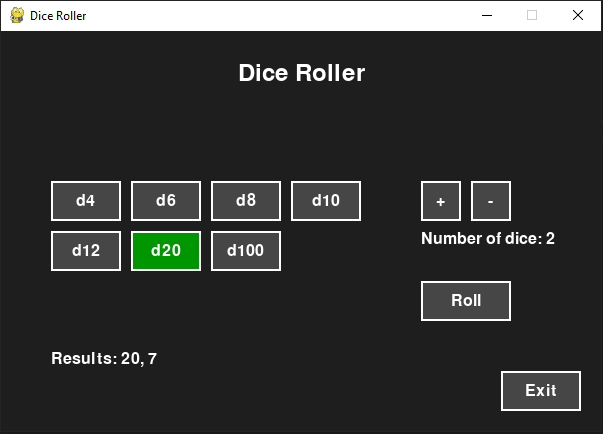

# 🎲 Dice Roller

A simple graphical dice roller built with Python and Pygame. Supports all the common polyhedral dice used in Dungeons & Dragons (d4, d6, d8, d10, d12, d20, and d100), and allows you to choose how many dice to roll.

---

## 🖥️ Features

- Select from standard D&D dice types
- Choose how many dice to roll (1–10)
- View individual roll results
- Simple and clean graphical interface using Pygame

---

## 📦 Requirements

- Python 3.7 or newer
- Pygame

---

## 📸 Screenshot

